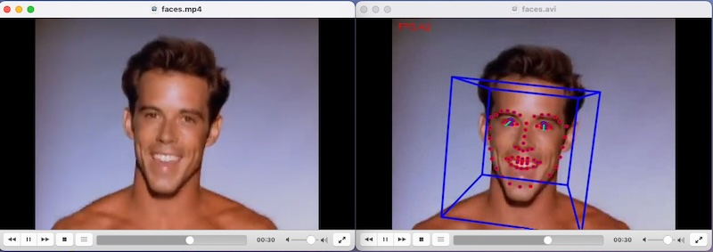

# OpenFace 2.2.0 for aarm64

## What is it?

[OpenFace](https://github.com/TadasBaltrusaitis/OpenFace) as docker container image for aarm64 environments.

## Motivation

The development of OpenFace stopped 5 years; nevertheless, it remains a valuable piece of software utilized in numerous research projects. OpenFace relies on outdated dependencies that pose challenges for compilation on aarm64 architecture. Therefore, I opted to develop a container that operates seamlessly on computers with ARM processors, such as the new Apple Silicon devices or AWS Graviton instances, eliminating the need of a complex compilation process and downloading large model files.

## Dependencies

It requies to install [docker](https://www.docker.com/products/docker-desktop/).

## Usage examples

Process multiple images from a directory:

    docker run --rm -it -v /host/input:/oface/input -v /host/processed:/oface/processed ghcr.io/juanparati/openface-aarm64:master ./FaceLandmarkImg -fdir input

Process a video file

    docker run --rm -it -v /host/input:/oface/input -v /host/processed:/oface/processed ghcr.io/juanparati/openface-aarm64:master ./FaceLandmarkVid -f input/myvideo.mp4

Replace `/host/input` with the path to the local directory that contains the input files.
Replace `/host/processed`with the path to the local directory that contains the processed files

## Executables included

- FaceLandmarkImg
- FaceLandmarkVid
- FaceLandmarkVidMulti
- FeatureExtraction

## How were the original binaries compiled?

See [origina/Dockerfile](origin/Dockerfile).

## Acknowledments

- [Tadas Baltrušaitis](https://github.com/TadasBaltrusaitis/OpenFace) 
- [Multicomp Lab](http://multicomp.cs.cmu.edu/)
- [Dr. Ana Alina Tudoran](https://www.au.dk/en/show/person/anat@econ.au.dk)

